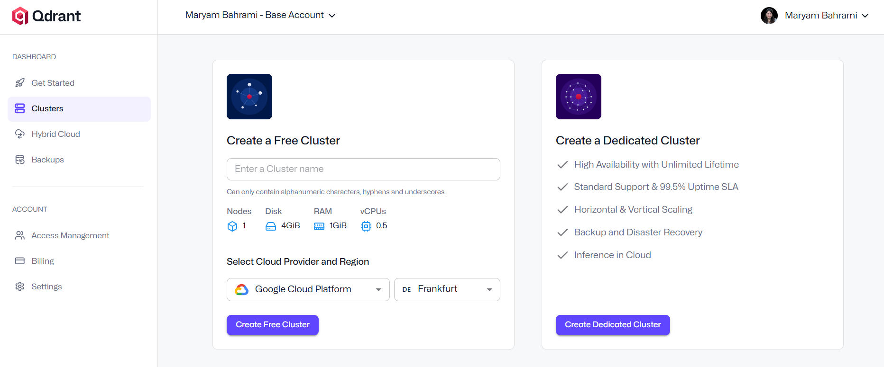

# 🚀 VoltAssist: Simple RAG Chatbot
VoltAssist is a simple RAG-based Streamlit-Powered customer support chatbot for E-commerce electronics stores,  empowering startups and small businesses to automate FAQs, product manuals, and customer interactions efficiently.
Account & Profile, Billing & Tax, Warranty & Repairs, Product Information & Support, Returns & Exchanges, Promotions & Gift Cards, Ordering & Payment, Inventory & Availability, Customer Service & Contact, Shipping & Delivery


# 📂 Repository Structure
.
├── data/
│   └── faqs.json        # Sample synthetic FAQ
│   └── update_database.py        # Create vector database
├── src/
│   ├── app.py               # Streamlit UI + chat logic
│   └── llm.py               # OpenAIClient class (prompt builder + responder)
│   └── rag.py               # Retriever function to retrive data from qudrant
├── .env                     # Your Qdrant and OpenAI API keys lives here
├── requirements.txt         # Python dependencies
└── README.md

# Steps for creating this chatbot: 🔧 Setup & Run
## 1- Prepare vector database
for creating the vector database, you need API key for  qdrant_url and api key for embeding model, which I used openai for text-embedding-3-small 
There are a lot of options for creating a small and free vector database for learning purpose, for this chatbot I've used Qdrant.
Creating a Qdrant Cluster is staightforward. You need to create an account in Qdrant and create a free cluster, and get your API key.
In the update_database file you will find how to create vector database.
after having all api keys and urls, choose a name for your database (collection name), and create a create qdrant collection, then createpoints for questions and answers and upsert(add) them to your collection.

## 2- create a retiriever to retrieve the data
in the rag.py you will find the retriever function to retrive the similar questions and answers for user input.

## 3 llm.py
```
class OpenAIClient:
    def __init__(self, openai_api_key, department, level):
        self.client = OpenAI(api_key=openai_api_key)
        self.department = department
        self.level = level
    def build_prompt(self, policy_summary, user_question) -> list[dict]:
        """Returns a messages list ready for ChatCompletion.create()."""

    def generate_response(self, messages: List) -> str:
        """Calls OpenAI and returns the assistant’s answer."""
```
## 4- Build your App

